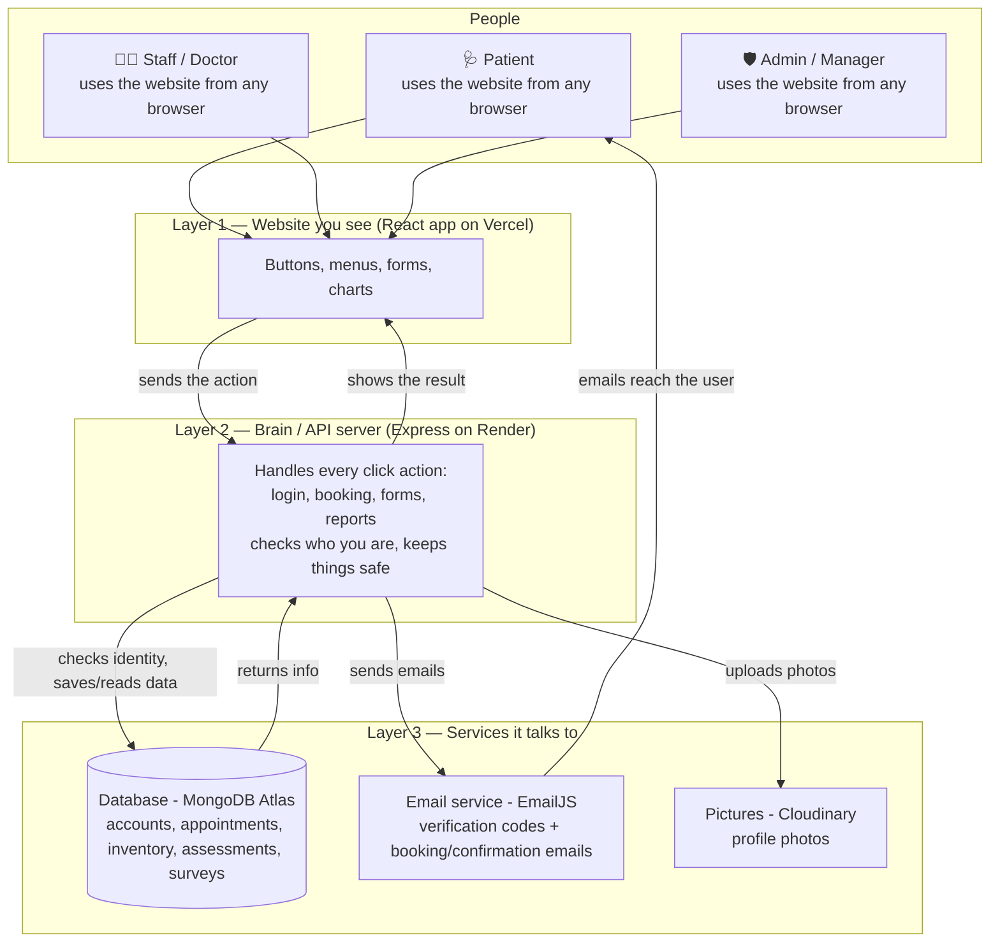
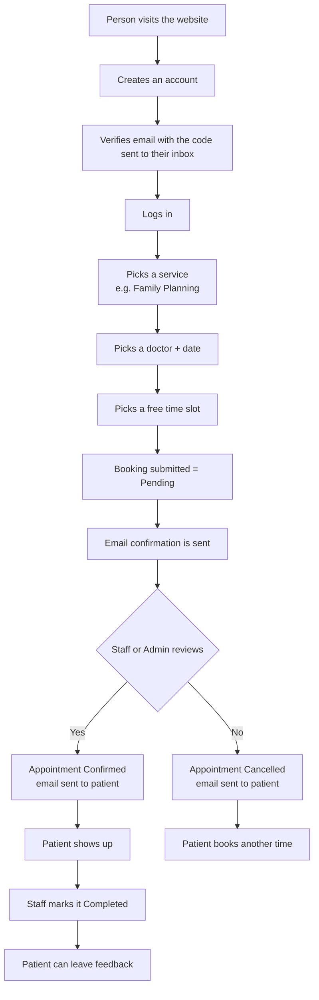
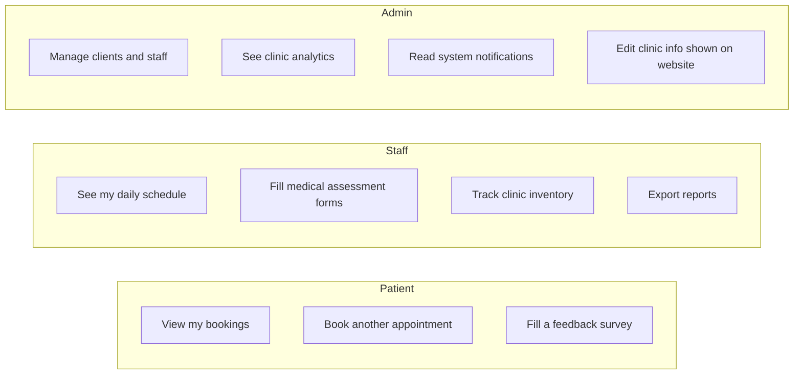

# FPOP HealthHub — Simple System Flow

## System architecture (how all the parts connect)

## Who uses it?

| Person | What they see/do |
|--------|------------------|
| **Patient** (the public) | Browse the site, book an appointment, see their bookings, give feedback |
| **Staff** (the doctors) | Check the day's schedule, confirm/decline bookings, fill medical forms, update inventory |
| **Admin** (the manager) | Oversee everything: users, appointments, reports, notifications, clinic info |

## Main flow — booking an appointment

## Side features

## Where things run

- **Website + controls** — a web app (on Vercel)
- **Brain / API** — a server that talks to the app (on Render)
- **Memory / Database** — where all accounts, bookings, and forms are stored (MongoDB Atlas)
- **Email service** — sends the codes and booking/confirmation emails (EmailJS)